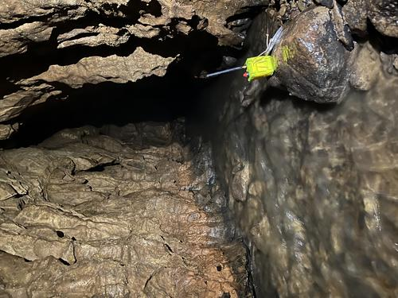
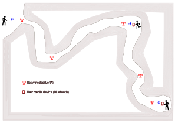
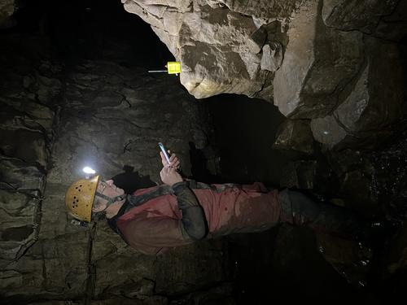
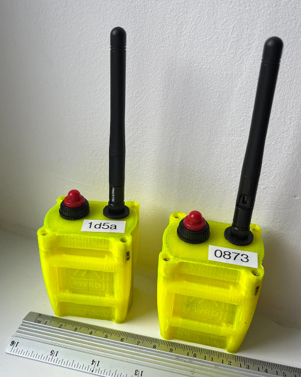
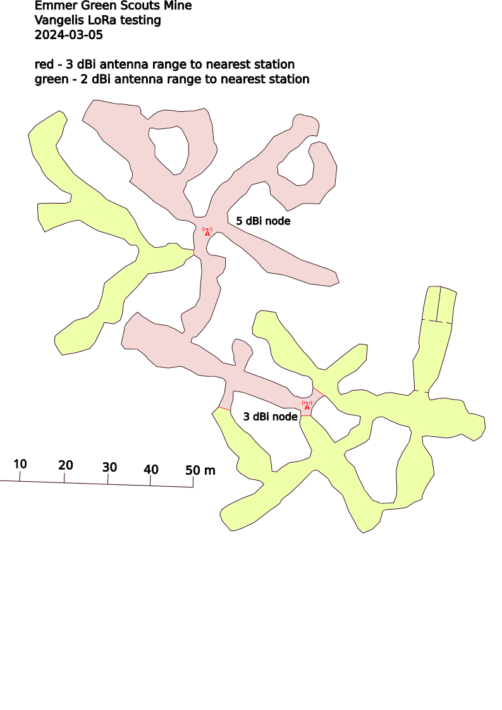
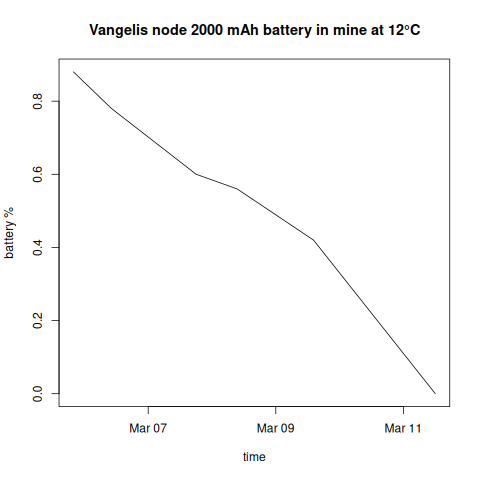

Long range, low power messaging system based on Meshtastic relays suitable for underground communications.

## Design principles
Natural caves are challenging as it comes to communications due to irregular cavity shapes, presence of water and general difficulty of installing any kind of equipment in an environment where everything has to be carried on human's back over hundreds of meters vertically. There are numerous existing solutions, each with its own challenges:

* Wired telephone is a reliable solution, however poses a significant investment due to the above challenges, plus it is easily damaged in confined or gravel passages.
* [Through-the-earth radio communications](https://en.wikipedia.org/wiki/Through-the-earth_mine_communications) using very low radio frequencies (HeyPhone, Nikola, CaveLink) are the most popular _ad-hoc_ communications solution during cave rescue or expeditions . Obtaining a reliable link at depths below hundreds of meters however is a lottery as many factors from geology to weather impact attenuation even at  low frequencies.
* Underground communication links based on radio repeaters was discussed at least since 2014[^1]. _Sybet_ came up with industrial solution [SPELLCOM](https://sybet.eu/batnode/)  using radio repeaters to relay voice communications over underground cavities.

The **Vangelis** project expands on all of the above by using autonomous low-power repeaters for relaying text messages rather than voice over low-power radio transmission:

* Radio transmission using [LoRA](https://en.wikipedia.org/wiki/LoRa) modulation using [Meshtastic protocol](https://meshtastic.org/docs/introduction) for routing
* Low-power radio transmission with maximum 200 m line-of-sight range for underground nodes
* Long-term autonomous operations of each relay node
* Low weight and portability of the nodes
* Range of surface relays limited only by LoRa radio reach, practically up to a few kilometers in mountainous areas
* Consumer smartphones connecting over Bluetooth to relay nodes using [Meshtastic app](https://meshtastic.org/downloads/) to send and receive messages

## Hardware

The system is composed of two node types: surface and underground. Each node operates in router-client mode, which allows both client device (smartphone) connection over Bluetooth and message relaying to other nodes over LoRa.

* **surface node** 
* **cave node** powered from a LiPo battery and intended to operate without recharging for the whole period of a cave operation

 and surface nodes (right)")

### Surface node

Relay node intended to be used outdoors and thus not subject to size and weight limitations. The prototype is powered from a 18650 cell with [PV charging](https://docs.google.com/document/d/12GIY24vLKLABg2RUTPP6yMzokr44GMzJOE4p7ngaCbI/edit#heading=h.9lmvuqjahqxl), equipped with a 3-5 dBi antenna. Typical usage scenario is to be installed at cave entrance and relay messages further to another such node at a base camp. The node can be equipped with a GPS receiver.

Bill of materials:

* [Clear Hinged Lid IP67 Waterproof ABS Electrical Enclosure Case junction box](https://www.ebay.co.uk/itm/304321459053)
* [WisBlock Meshtastic Starter Kit](https://store.rakwireless.com/products/wisblock-meshtastic-starter-kit)
* OLED Display [Solomon SSD1306 - RAK1921](https://store.rakwireless.com/products/rak1921-oled-display-panel)
* [RAKBox-B5 Transparent Acrylic Enclosure](https://store.rakwireless.com/products/rakbox-b5-transparent-acrylic-enclosure)
* [Outdoor LoRA antenna](https://store.rakwireless.com/collections/outdoor-antennas) any antenna can be used, two prototype nodes were built with 3 dBi and 5 dBi antennas
* 3D-printed antenna holder, STL for RAK [3dBi Fiberglass Antenna](https://store.rakwireless.com/products/3dbi-fiber-glass-antenna) or [5dBi Fiberglass Antenna](https://store.rakwireless.com/products/5dbi-fiber-glass-antenna-supports-863-870mhz) are available
* [5V  1.25W  250 mA photovoltaic panel](https://www.ebay.co.uk/itm/113383833070), 110mm x 69mm, 2.4mm

Notes:

* OLED display is optional. It's mostly useful when pairing smartphone with Meshtastic over Bluetooth using a random PIN code, but since these are impractical underground, the nodes are configured to use no PIN at all. Since it also displays last packet information etc it's a nice to have.
* Choice of the antenna is of paramount importance for outdoor LoRA range. Poor antenna will limit the range to tens or hundreds of meters at best, even in line of sight. With RAK 3-5 dBi antennas we easily get kilometers long range. It does not matter for underground nodes as their range is limited by rock anyway.
 
### Cave node

Durable, waterproof case made of 3D-printed plastic, indented to be operated in hostile environment and simplified operations. Prototype weight ~130 grams. The only user interface is the power button on the top, that is big enough to be operated in gloves. The WisBlock board has a green, blinking LED which is visible through the plastic case and serves as an indicator that the device is live and transmitting. The case has an USB-C port on the bottom that in normal conditions is closed with a rubber seal.

#### Bill of materials

RAK Wireless parts:

* Use [this link](https://rakwireless.kckb.st/15fac583) - 5% for the project support
* `BYKKDT` at checkout - 3% discount
* `WELCOMEBACK10` at checkout - 10% discount

Order:

* [RAK WisBlock Mini Base Board RAK19003](https://store.rakwireless.com/products/wisblock-base-board-rak19003)
* [RAK LoRa Core Module RAK4631](https://store.rakwireless.com/products/nordic-nrf52840-ble-core-module-for-lorawan-with-lora-sx1262-rak4631-rak4631-c) (includes [BLE-PCB Bluetooth antenna](https://store.rakwireless.com/products/ble-pcb-antenna-5-5dbi) and [PCB LoRa antenna](https://store.rakwireless.com/products/pcb-antenna-for-lora))
* [RAK barometric pressure sensor RAK1902](https://store.rakwireless.com/products/rak1902-kps22hb-barometric-pressure-sensor)
* [IPEX to RP-SMA connector](https://store.rakwireless.com/products/ipex-to-sma-connector)
* [LoRa 2 dBi SubG antenna](https://store.rakwireless.com/products/lora-antenna)

The above set is a "safe default", sourced from a single supplier with predictable quality. RAK SubG antenna is not flexible which is a bit of disadvantage. There's quite a lot of LoRa antenna suppliers available on electronic stores but quality of most of them is unpredictable. These two can be considered as flexible alternatives to RAK SubG, but they will require slightly different assembly:

* Amazon UK: Flexible [IPEX-1 TX868-JZLW-15](https://www.amazon.co.uk/TX868-JZLW-15-Equipment-Logistics-Construction-Enthusiasts/dp/B0978Q7N7C/)
* Amazon DE: [FLEXI-SMA-868](https://www.amazon.de/FLEXI-SMA-868-Antennen-Geschirrantennen-RF-Antenne-Satelliten-Ausr%C3%BCstung/dp/B09HMMH8ZY)

3D-printed:

* [TacMesh Waterproof Enclosure](https://www.thingiverse.com/thing:5923930/) 3D printed from PLA, [assembly instructions](https://youtu.be/gpnivx2jVRk) (in German)

Assembly notes:

* Do not put too much resin at the USB port base as it will bond the middle insert and battery, making the electronics impossible to remove for repair or firmware upgrade; 2.5-5 ml is probably just enough
* Do not glue the battery to the internal insert
* 3D printer precision depends wildly on the model and printing speed - you will most likely find especially the M2.5 brass inserts too loose
* LiPo batteries come with different plug sizes and polarization - please double check that battery red cable (+) is linked to the inside contact, closer to the USB-C port on the WisBlock Base board

Other parts:

* [M2.5×4×3.5 threaded brass inserts](https://www.amazon.co.uk/dp/B07SYP6PRJ)
* [Waterproof on-off switch](https://www.amazon.co.uk/dp/B0BKK4RXYX)
* [3.7V 2000 mAh LiPo battery](https://www.amazon.co.uk/dp/B08HD33ZKB)
* [Rubber washer 16x6x1.5 mm](https://www.amazon.co.uk/dp/B01N7WI68Z)
* [Rubber O-ring 49x45x2 mm](https://www.amazon.co.uk/dp/B0C1524ZMR)
* [USB-C male to female coupler](https://www.amazon.co.uk/dp/B0B18SLFD4)
* [Rubber USB-C plugs](https://www.ebay.co.uk/itm/144021649084)
* Optional: [Tactile 4x4x1.5 mm push button](https://www.amazon.co.uk/dp/B08F7V2Y66) not installed in the cave prototypes and mostly needed for node reset for firmware upgrade

### Future improvements

#### Barometric altitude

As cave nodes are located through the cave, they have no means of determining their own location as GPS signal is unavailable. Barometric pressure sensor allows to [correlate the pressure](https://en.wikipedia.org/wiki/Barometric_formula) seen by a node with altitude above mean sea level ([AMSL](https://en.wikipedia.org/wiki/Height_above_mean_sea_level)) as long as at least one surface node is equipped with GPS receiver _and_ barometric pressure sensor. The surface node would then operate as the barometric/altitude reference for the whole network. With this improvement, the Meshtastic application would see the nodes identified by their depth rather than merely names, e.g.:

1. 0 m relative (surface node)
2. -50 m
3. -100 m
4. -200 m
etc

Messages sent to the channels could be also identified by the depth of the respective relay node, thus indicating that team X has reached -100 m, then -200 m etc.

#### Cable communications

Long, tight crawls are especially challenging for connecting using relay nodes due to relatively short (~10 m max in our tests) radio range and high risk of the nodes being displaced or damaged by cavers moving with bags in confined space. In theory, the nodes could be also connected using a serial cable connected to the USB-C port, which could replace the radio link through the problematic tunnel. The Meshtastic firmware currently supports [serial communications](https://meshtastic.org/docs/configuration/module/serial/) but not exactly for node-to-node links. The length of such a hypothetical link and how it would need to be powered is also unknown.

# Wet Sink testing

Initial testing in real-life conditions was performed with [GCRG](https://gcrg.org.uk) in [Wet Sink cave](https://en.wikipedia.org/wiki/Slaughter_Stream_Cave) which offers all typical karst cave features - pitches, chokes, tight squeezes, water.

1. One "surface" node was placed at the head of entrance pitch. Another one was carried down until signal was lost, which came out to be nearly at the bottom of the next pitch (Mouse pitch).
   This covered ~20 m vertically with a horizontal displacement of ~5 m in a choke in the middle.

2. Three "cave" nodes were used to create a link through a tight ~30 m long crawl joining the bottom of the Pen Pot pitch with Cross Stream Junction. The crawl is 30-40 cm high
   with numerous sharp turns on the way.

3. Two nodes were carried from Cross Stream Junction in opposite directions as long as the signal lasted. The devices were able to communicate through a rather spacious (2x3 m) tunnel
   with no line of sight over at least four sharp turns. The total walking distance covered was ~40 m.

4. Additional relay node was added right at the Cross Stream Junction. Mobile nodes were again carried in opposite directions. The total walking distance covered was ~70 m across the same sharp bends
   plus some smaller tunnel irregularities.

The testing was intentionally performed in confined parts of the cave to check the worst case scenario first and the above distances indicate performance of the system under such conditions.
In spacious caves, both horizontal and vertical, there's no reason why the links couldn't reach the usual surface line-of-sight range, that is up to 200 m in case of the 2 dBi antennas. 

The above drawings are based on the 2004 survey drawn by Paul W. Taylor, simplified for readability.

# Emmer Green mine testing

Testing was performed in March 2024 in Emmer Green chalk mine
to which access was kindly provided by 89th Scouts Group. The
testing session had two objectives: range testing and battery life
in real-world mine conditions.

## Range testing

Range testing used the Range Test module which sends periodic messages
with sequentially increasing numbers (`seq 1`, `seq 2` etc). The module
was configured to send messages every 15 seconds. This makes the
testing procedure as simple as walking away from the last placed node
until notifications are heard for incoming messages. When they no longer
are, we mark end of range.

1. One node with 5 dBi antenna was placed at the bottom of the
   entrance shaft with range test mode enabled 
2. Second node with 3 dBi antenna was moved in tunnels away from
   the entrance shaft.

**Result:** the 3 dBi node had stable connection in all mine tunnels
NW, NE, W and E from the pitch, marked in red colour on the map below.
In the S tunnel the range was ~70 m walking distance including one sharp
bend E through a lower entrance. The node was left under the
second capped mine shaft, as marked on the map.

3. Another mobile node with 2 dBi antenna was again being carried
   in the remaining tunnels.
   
**Result:** the 2 dBi mobile node had stable connection in all 
mine tunnels, including two underground bunkers reinforced with
corrugated steel (Nissen huts), through numerous bends and squeezes.
The 2 dBi node range is marked with the pale green colour on the map.

## Battery life testing

One 2 dBi cave node was left at the bottom of the entrance shaft
and retrieved a week later. Remaining nodes were placed on the surface
to relay messages from the bottom to my house, which provided periodic
device status updates, including battery level and temperature.

At the end of the range testing the cave node was at 88% which
was the starting condition for the battery life test on 5 March. The temperature
reported by the device remained around 12°C through the whole test.

| Timestamp | Battery [%] |
| --------- | ----------- |
| 2024-03-05T19:54 | 88% |
| 2024-03-06T10:10 | 78% |
| 2024-03-07T18:02 | 60% |
| 2024-03-08T09:26 | 56% |
| 2024-03-09T14:12 | 42% |
| 2024-03-11T12:00 | 0% |

**Result:** the node worked stable for 6 days, reporting almost
linear battery deterioration over that period. The node sent the last
status message around noon on 11 March, reporting battery depleted
to zero.

## Footnotes

[^1]: M. D. Bedford; G. A. Kennedy [Modeling Microwave Propagation in Natural Caves Passages](https://ieeexplore.ieee.org/abstract/document/6933914/),  IEEE Transactions on Antennas and Propagation, 2014
